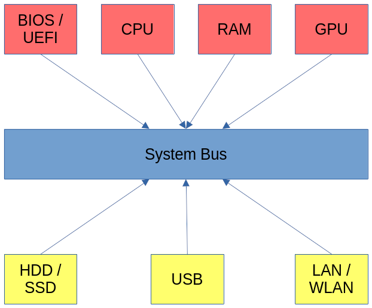

A quick overview on how computers work
======================================

This is just a rough description of a modern computer:

.. _computer_overview:

The most important components are:

.. index::
  single: CPU
  single: RAM
  single: HDD
  single: SSD
  single: GPU
  single: USB
  single: system bus
  single: LAN
  single: WAN
  single: BIOS
  single: UEFI

* **CPU:** Central Processing Unit, executes all the software.
* **RAM:** Random Access Memory, the main memory. Holds all the data that running programs are using and the programs themselves.
  Does not persist data, everything is lost when power down.
* **HDD / SSD:** Hard Disk Drive / Solid State Disk, persisten data storage bigger and slower than main memory.
* **GPU:** Graphical Processing Unit, draws stuff on screen and sends it to the monitor. Can also do some computations (GPGPU).
* **USB:** Universal Serial Bus, connection for all external devices: mouse, keyboard, printer, scanner, camera, ...
* **System Bus:** Connects all the internal and external components together. This is the main bottleneck of the system.
* **LAN / WLAN:** Local Area Network / Wireless Local Area Network, connection to other systems.
* **BIOS / UEFI:** Basic Input Output System / Unified Extended Firmware Interface, when the system is turned on this is the first program
  that runs loads the operating system from disk.
