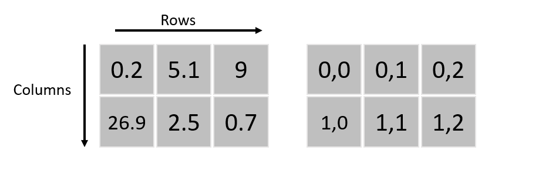
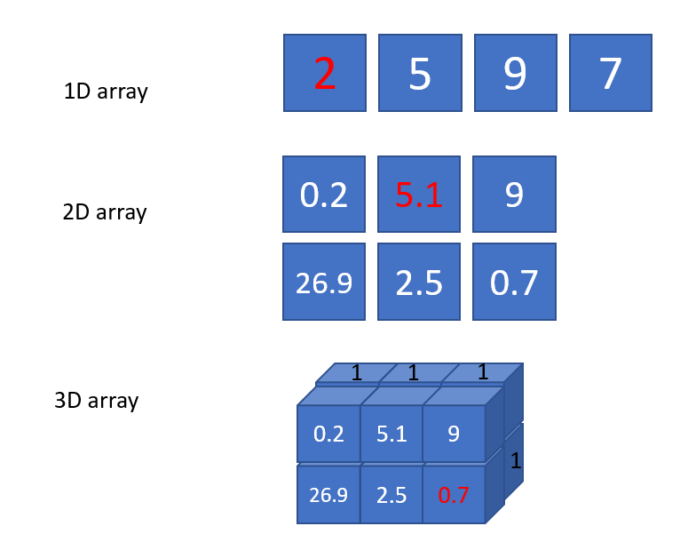

The Python programming language
===============================

Python is a dynamically and strictly typded interpreted programming language.

You have already seen a small python program in the last chapter. Python files have the file exrension **".py"**.
Each program contains statements, which can be definitions or expressions.

.. index:: single: types

Types
-----

Every Python expression has a specific type. Types are very important in Python and other programming languages as well.

Some of the most simple built-in types are:

.. index::
    single: bool
    single: integer
    single: float
    single: None

* Boolean values: ``True, False``
* Integer values: ``1, 2, -12, ...``
* Floatingpoint values: ``1.0, 5.78, 3.14159, -20.257, ...``
* The absence of a value: ``None``

Integer is a whole number, while a floating-point number, also known as a float contains decimal places. Please be
aware that in python the decimal separator is a not a comma (``","``) as used in German but a fullstop ``"."``. If the input
does not consist of numbers but of letters, punctuaction marks, digits, empty spaces (basically anything other than
just numbers), then it is defindes as a character string, or often referred to as a string. When you define a string you
put the input into quotation marks.

Some of the complex (compound) built-in types are:

.. index::
    single: list
    single: tuple
    single: string
    single: dict

* Lists: ``[1, False, 44.5, "Tübingen"]``
* Tuples: ``("Heisenberg", 2, -5)``
* Strings: ``"Käsespätzle"``
* Dictionary: ``{"red": 1, "green": 2, "blue": 3}``

These are also called data structures. And in Python (and other programming languages) they are implemented as classes.
These types can also be nested:

* Lists: ``[[1, 2, 3], ("a", "b", "c"), 3.4, [(5, 5), (6, 6)]]``
* Tuples: ``(("geo", 2), [7, -3.5, (9, 10)], "Einstein")``

The difference between a list and a tuple is simple: list can be changed, but tuples not.
But tuples are faster in Python code. List access and creating a list is slower.

External types (must be imported):

* Numpy array, vector: ``np.array([2.5, 7.89, -11.2])``
* Numpy array, matrix: ``np.array([[2.5, 7.89, -11.2], [-1.1, -2.2, -3.3]])``

Note that lists and tuples can have different types, but Numpy arrays can only have values of one type!

.. index:: single: variables

Variables
---------

Variables are also very important in Python and other programming languages. As the name implies they can change their values unlike constants.
In Python and other dynamically typed programming languages, variables can also change their types.
A variable is a reference to a stored value. For instance if your code contains the line ``a = 3``, that means that the value
3 is stored under the variable a. Variables can be assigned to individual values, lists, matrix, strings, arrays etc.

Examples:

.. code-block:: python

    a = 4
    b = 6
    c = a + b

    a = "Hello"
    b = c < 10

When assigning variables to values make sure to assign sensible names, which allow you to understand what the
variable is about. Do not call variables a, b, c but refer to what the value represents, such as temperature, pressure
etc. These general rules apply to naming variables:

* has to start with a letter
* operator symbols are not allowed
* underscore can be used

The value of a variable can be changed at any time and you can assign a second variable to the same object. Here
it is important to note that Python will not create a sceond object doing this but just a second reference. So if you
change the first variable, that will automatically change the second as well:

.. code-block:: python

    # Attention: this will not copy l1.
    # It's just a pointer to the same data:
    l1 = [1, 2, 3]
    l2 = l1

    l2[0] = 10

    print(f"The first list is: {l1}") # 10, 2, 3
    print(f"The second list is: {l2}") # 10, 2, 3

.. index:: single: comments

Comments
--------

To add comments use the ``"#"`` symbol. It is very essential that you get used to commenting your code. That helps if
you 1. need to go back to your code at a later stage, or 2. give the code to someone else or 3. If this is part of the
exam and the examiners need to grade your exercise. Using descriptive names will help you and others understand
the code more easily later on. This means, a variable named ``"CO2_values_monthly_filtered"`` tells you directly what
this dataset is and for instance if it is filtered or not, compared to ``"Data"`` or ``"test123"``.

Always remember that more time is spend reading a code than writing it. So the more effort you put into commenting
it so that a reader (which might well be you in the future) can easily understand what the code is doing. Ideally start
a code by stating by whom, when and for what the code was written. Also further information on the requirements
of the code, e.g. do you need to import data in a certain format etc. is useful.

.. index:: single: operators

Operators
---------

.. _python_operators:

.. csv-table:: Python operators
   :header: "Operator name", "Operator", "Example", "Result"
   :align: center

    "addition", "\+", "2 + 3", "5"
    "substraction", "\-", "7 - 2", "5"
    "multiplication", "\*", "3 * 4", "12"
    "division", "/", "6 / 2", "3"
    "exponentiating", "\*\*", "2**3", "8"
    "modulus", "%", "7%3", "1"
    "integer division", "//", "10//6", "1"
    "comparison", "<, <=, ==, !=, >, >=", "5 < 8", "True"
    "index", "[]", "l1[2]", "thrid element of list"
    "", "", "l1[-1]", "last element of list"

Operator work on other types as well:

.. code-block:: python

    a = "Hello"
    b = "World"
    c = a + " " + b
    c[1]
    print("a" * 5)

    l1 = [1, 2, 3]
    l2 = [4, 5, 6]
    l3 = l1 + l2
    print(l3[0])

    t1 = (5, 5, 5)
    t2 = (7, 7, 7)
    t3 = t1 + t2
    print(t3[-2])

As you can tell, you can use the ``"+"`` operator to add strings. And you can multiply a string with a number, which
causes the string to be printed several times. However, you can not add a number (integer or float) with a string.

.. index:: single: binary

Binary data
-----------

Caution! Be aware that python is working in a binary format, which only knows 0 and 1. Every number is
represented by a combination of 1s and 0s. The following list gives a few examples of integer numbers and their
corresponding binary numbers in a 8-bit system:

.. _binary_numbers:

.. csv-table:: Binary numbers
    :header: "Integer", "Binary", "Integer", "Binary"
    :align: center

    "0",   "0000 0000", "6",   "0000 0110"
    "1",   "0000 0001", "7",   "0000 0111"
    "2",   "0000 0010", "8",   "0000 1000"
    "3",   "0000 0011", "9",   "0000 1001"
    "4",   "0000 0100", "10",  "0000 1010"
    "5",   "0000 0101", "...", "..."

This has been the case for many years and therefore works well, except when you work with numbers that have an
indefiniete amount of decimal numbers, such as given for 1/6 which is 0.1666666666..., these numbers can only be
approximated in a binary form. As a result you might encounter problems:

.. code-block:: python

    a = 1.1 + 2.2
    print(a) # 3.300000000000000003
    print(a == 3.3) # False

.. index:: single: index

Indices
-------

As you have seen the index operator "[]" can be used on data structure to access the elements of that data structure.
Typical data structres in Python used in this class are list, tuples, arrays and dictionary. Remind yourself of the
difference between these different datatypes.

* numpy arrays: all elements are of the same type
* list: elements can be of different type
* tuple: elemnts can be of different type but the values and types can not be changend once defined
* dictionary: a mapping between a key and a value. Can be changed. Keys must be of the same types, values can be of different types.

.. index::
    single: numpy
    single: array

Numpy arrays
------------

In the library ``numpy`` the function ``array()`` enables you to define different arrays, such as for instance a 1D array, a
2D array, 3D array. These are defined row-wise (row-major):

.. _array_index:

Examples of a 1D, 2D and 3D array. Imagine that all values in the second array (the one in the back) of
the 3D array are 1:

.. _1D_2D_3D_arrays:

In order to use the numpy library you have to install it first and after that you can import it:

.. code-block:: python

    import numpy as np

    a = np.arange([1, 2, 3, 4])
    print(a)
    print(f"The first element is: {a[0]}")

.. index::
    single: size
    single: dimension
    single: shape

Check size, dimensions and type of data
---------------------------------------

Here are some useful commands and functions that describe your data:

* ``a.ndim``: the dimensions of the numpy array (1, 2, 3, ...).
* ``a.size``: the total number of elements in a numpy array.
* ``a.shape``: the shape of the numpy array, number of rows, cols, ...

* ``type(a)``: the type of the varaible a.
* ``len(a)``: the number of elements in the data structure a. For numpy arrays the outer layer.

Useful functions
-----------------

.. index::
    single: arange
    single: del
    single: append
    single: sort
    single: min
    single: max

* ``arange(0.0, 100, 0.5)``: create a numpy array with evenly spaced values in the given interval.
* ``a[:, 3]``: select the second column with all rows from a numpy array.
* ``del a``: delete a variable and free the memory (any type).
* ``l.append(15)``: append the element ``"15"`` to the end of a list.
* ``l.sort()``: sorts a list of items.
* ``min(), max()``: find the smallest / biggest element in a built-in data structure.
* ``np.min(), np.max()``: min, max for numpy arrays.

.. _exercise_2_1:

.. attention:: Exercise 2.1:

    * Use the library ``numpy`` to create the three arrays shown above with the function ``array()``.
    * Once the three arrays are created write a ``print()`` command that states the dimensions of these arrays.
    * Print out what is the maxium value in the first coloumn of the 2D array.
    * There are three numbers shown in red. Which command will print out these values?

.. index::
    single: module
    single: package

Modules and packages
--------------------

A package (also called a library) can have multiple modules. You can also define your own modules and packages.
Every Python file it actually a module that has to be imported.
Python does have a standard library with many useful modules.
And there are a lot of external Python packages available.

These are the one that we will be using as mentioned earlier:

* **numpy**: NumPy, which is short for Numerical Python, is used when working with arrays. It includes functions of lineare
  algebra (similar to Matlab), fourier transform, and matrices.
* **matplotlib**: Most packages that we use in this class are located in the submodule pyplot in the matplotlib-library. This submodule
  is ofter imported under the alias plt.
* **pandas**: A library used when working with data sets or database. It is usefull when analysing big dataset for a specific
  conditions, cleaning it up, manipulating it (merging data etc.).

