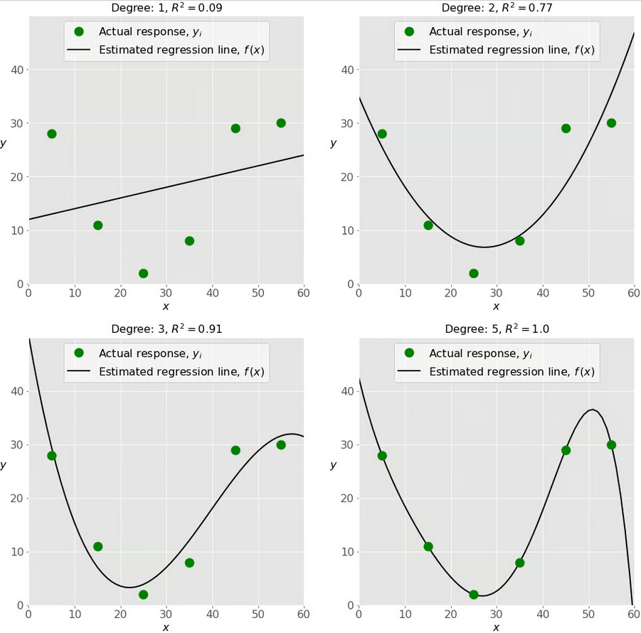

Math functions
==============

.. index::
    single: sinus
    single: gauss 1D

Visualization of mathematical functions
---------------------------------------

Make use of some numpy functions (``numpy.arange``) and get a feel for some vector manipulation.

.. attention:: Exercise 4.5:

    * Visualize :math:`f(t)=\sin(\omega t + \phi_0)` for a given frequency :math:`\omega = 1.2Hz` and phase shift :math:`\phi_0` over the time
      interval :math:`t = 0...10` at discrete time intervals :math:`dt = 0.001` s.
    * Visualize :math:`f^2(t)`. What happens if you reduced dt to 1 s ?
    * Visualize a Gaussian peak:

      .. math::
        f(x) = Ae^{-\frac{(x-x_0)^2}{\sigma_x}}

      where x is the independent variable and the factors :math:`x_0` , :math:`A`, and :math:`\sigma_x` determine the shape of the function.
      Make sure that you understand what each parameter pertains to.

.. index::
    single: gauss 2D
    single: pcolormesh
    single: meshgrid

More loops
----------

.. attention:: Exercise 4.6:

    Visualize a 2D Gaussian peak:

    .. math::
        f(x,y) = Ae^{-\frac{(x-x_0)^2}{\sigma_x}-\frac{(y-y_0)^2}{\sigma_y}}

    using a nested for loop. This is harder. In essence you will need to fill a 2D array and visualize it with colors
    using ``plt.pcolormesh()``. Then do the same but replace the nested for loops using numpys ``"meshgrid"``.
    What is easier?

.. index::
    single: recursion
    single: fib
    single: fibonacci

Recursion
---------

There is a third way to do loops in Python (and other programming languages as well): If you define a
function you can call that function recursively:

.. code-block:: python

    def Fibonacci(n):
        if n < 0:
            raise ValueError(f"Negative numbers are not allowed: {n}")
        elif n == 0:
            return 0
        elif n == 1 or n == 2:
            return 1
        else:
            return Fibonacci(n - 1) + Fibonacci(n - 2)

    print(f"F0: {Fibonacci(0)}")
    print(f"F1: {Fibonacci(1)}")
    print(f"F2: {Fibonacci(2)}")
    print(f"F3: {Fibonacci(3)}")
    print(f"F9: {Fibonacci(9)}")

Mathematically the Fibonacci numbers are defined as:

.. math::
    F_{n} = \left\{
        \begin{array}{ll}
            0, & n = 0 \\
            1, & n = 1 \\
            F_{n-1} + F_{n-2}, & n > 1
        \end{array}
    \right.

.. attention:: Exercise 4.7:

    Now write the Fibonacci function in a non-recursive way using a *for loop* or a *while loop*.

.. index::
    single: regression
    single: polynominal
    single: polyfit
    single: polyval

Regressions
-----------

Regression analysis is a way to determine a realtion between different parameters or variables. Such a relation might
be linear (first order) or polynominal (higher order). To determine how good the fit of the regression is to the actual
data, we can calcualte the :math:`R^2` value. The higher the :math:`R^2` value, the better the fit to the data. Let's look at the figure below.
Here the green dots are our exemplary datapoint. Panel 1 shows a linear fit, Panel 2 a second order, Panel 3 a third
order and Panel 4 a forth order fit. We see the :math:`R^2` value increasing with every panel. In this example the exemplary
data is created using a forth order polynominal function.

Using the polyfit function you can fit a n-th order function to your data. The output of this function then is a vector
of coefficients p that minimise the squared error of the fit to the data. For instance for a linear fit the fit looks like:

.. math::
    y(x) = mx + b

for a 2nd-5th order polynominal:

.. math::
    y(x) = ax^2 + bx + c

    y(x) = ax^3 + bx^2 + cx + d

    y(x) = ax^4 + bx^3 + cx^2 + dx + e

    y(x) = ax^5 + bx^4 + cx^3 + dx^2 + ex + f

To evalualte this polynominal at specific values (given as x) use the ``polyval`` function.

You can read more about it here: https://en.wikipedia.org/wiki/Coefficient_of_determination

.. attention:: Exercise 4.8:

    Load the Keeling curve. Fit a first and second order polynomial to the dataset. We understand
    that this type of fitting must have been solved by somebody else already and therefore use functions to do
    the task, specifically numpy's ``polyfit`` and ``polyval`` combination. Visualize the seasonality by subtracting
    the fit from the observations. Which models (i.e. first or second order polynomial) fits better and what
    does that mean?
